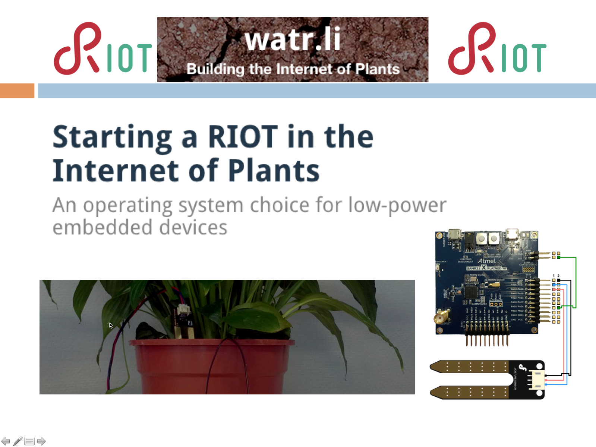
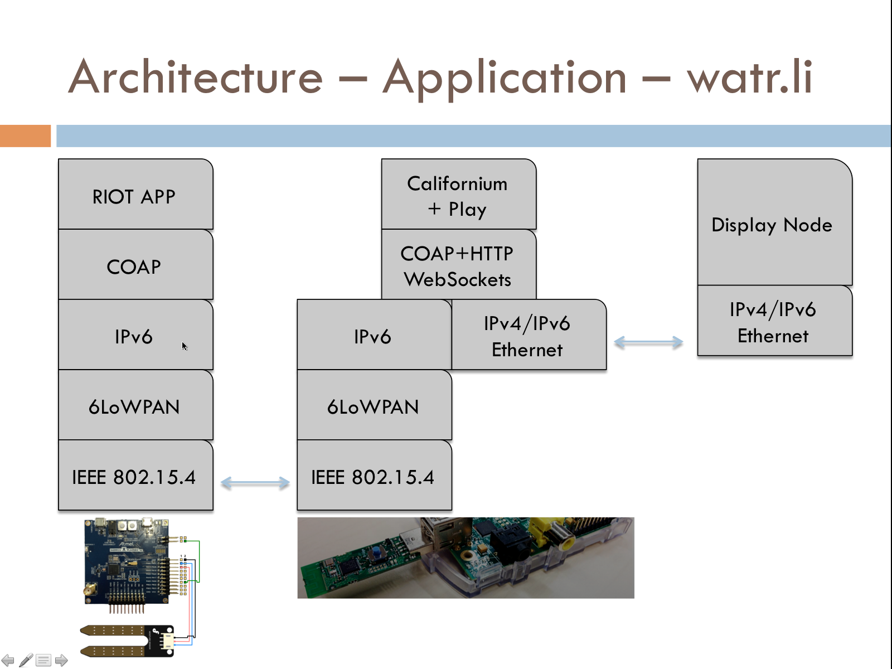

Original demo from [watr.li](http://watr.li/)

---------------------------------------------------------------------------

---------------------------------------------------------------------------

The following steps (and more) are now available throught the small GUI
  tools/TkDemo.py

1) Do a "make debug-server" in RIOT/Application directory so that 
   the Sam R21 XPro is stopped (I guess)

2) Plug R-Idge router in RPi USB port
  (802.15.4 sniffer gets: "Multicast Listener Report" + "Neighbor Solicitation")

3) run ./setup.sh on the RPi
  (802.15.4 sniffer gets 6LoWPAN data packets + Multicast reports and NS)
  that script does:
  > sudo modprobe ipv6
  > sudo ip -6 address add 2001:db8:1::1/64 dev usb0

4) Start dashboard with ./dashboard.sh (takes time) on the RPi
  [this launches Java + ./stage/bin/dashboard]
  It is possible to access from Mac computer: http://192.168.3.2:9000/  
  (RPi ethernet address)

5) Start nginx proxy with "./start_proxy.sh" on the RPi
  (I guess it is the server COAP -> Californium+Play ?) 

6) Start rpl on the RPi with ./start-rpld.sh
   [ this does: sudo ./rpld/rpld/rpld -i usb0 -d 2001:db8:1::1 ]
  one can see Router Solicitation + DIO

7) Flash the Sam R21 XPro

---------------------------------------------------------------------------

On the RPi, that was changed:
 * in contiki/core/net/rpl/rpl-conf.h
 * in contiki/core/net/rpl/rpl-private.h

...DOUBLINGS = 1
...MIN = 11

---------------------------------------------------------------------------
